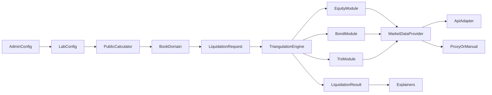

# Liquidity Lab — scope plan

**Status:** On hold (saved 6 August 2026). Do not implement until resumed.  
**Companion research:** [liquidity-lab-financial-engineering.md](./liquidity-lab-financial-engineering.md) · [liquidity-lab-market-data-apis.md](./liquidity-lab-market-data-apis.md)

## Overview

Scope a public Liquidity Lab that answers how to liquidate different asset types (volume, horizon, cost) using ADV-based participation, modular asset models, and pluggable market data; Site Admin only configures providers, proxies, and defaults.

## Intent

**Core question:** *How do I liquidate various types of assets?* — given a position, what does it cost, how long does it take, or how large a book can I exit under a given constraint?

**Liquidity Lab** at `/labs/liquidity`: a **public** tool that answers that for different instrument types under an **ADV / participation** model, with **explainers**. **Site Admin** only configures the Lab (providers, proxies, defaults). Visitors do not need to sign in. Runs stay ephemeral.

New Lab pattern vs Job OS (fully gated): public product surface + thin authenticated config. Update Site glossary so “Lab” is not assumed gated-only.

## Locked product decisions

| Decision | Choice |
|---|---|
| Driving question | How to liquidate across asset types (cost / horizon / size) |
| Audience | Public polished demo + usable tool |
| Access | **Public calculator**; **Admin config only** behind site Sign-in |
| Live asset modules (v1) | Equity, bond, TRS |
| Other asset classes | Registered stubs (taxonomy + explainers; no invented numbers) |
| Engine shape | **ADV** + participation; **any 2 of 3** → solve the third |
| Volume basis | **ADV** from market history or proxy |
| Triangulation inputs | Liquidation volume · target horizon (days) · target cost (bps) |
| Scenario (v1) | ADV multiplier · bid–ask multiplier · price volatility · **mean only** |
| Deferred (maybe later) | Confidence bands (50–99%); alternate impact engines |
| Unit of work | Single-position UI; **book-shaped domain** underneath |
| Persistence | Ephemeral visitor runs (no saved scenarios in v1) |
| Market data | Pluggable providers. v1 stack: **Twelve Data free** (US equities + proxy ETFs) primary, **Alpha Vantage free** (LSE/international, cached once per symbol per day), **Stooq CSV** fallback. **Instrument proxy** + **market-data proxy** when feeds gap |
| Spread input | No free bid/ask feed exists — use a **heuristic spread model** (bucketed by market-cap/ADV notional), labelled as an estimate; scenario multiplier applies on top |
| Auth | Site Sign-in for **config only**; Lab does not own auth; API secrets stay server-side |
| Licensing posture (open) | Free tiers are personal-use; public display is a formal risk. Options when resumed: accept risk + cache/attribution, pay for display rights, or public UI on curated/admin snapshots only |

## Domain sketch (new context)

Add a Liquidity Lab context (update [CONTEXT-MAP.md](../../CONTEXT-MAP.md); new `docs/liquidity/CONTEXT.md` or equivalent when terms crystallise). Core nouns:

- **Instrument** — typed identity (equity / bond / TRS / stub types); may resolve via API or **instrument proxy**
- **Market snapshot** — price, **ADV**, spread (or substitutes); provenance `api | proxy | manual`
- **Position line** — instrument + size (book can hold many; UI shows one)
- **Liquidation request** — exactly two of {volume, horizon, costBps} set
- **Scenario** — ADV multiplier, bid–ask multiplier, volatility (mean path)
- **Liquidation result** — solved third quantity + schedule footprint + assumption trail
- **Asset module** — plugin: validate inputs, map to cash underlier if needed, contribute cost/horizon maths, supply explainers
- **Market data provider** — plugin: resolve symbol → snapshot
- **Lab config** — Site Admin–managed settings the public calculator reads (active provider, proxy maps, default scenario knobs, featured instruments). Secrets never shipped to the browser.



## Calculator contract (v1)

Researched in depth — full derivations, sources, and disagreement flags in [liquidity-lab-financial-engineering.md](./liquidity-lab-financial-engineering.md). The v1 model is the practitioner "sigma-root-participation" pre-trade form (Grinold–Kahn / Barra / Kissell lineage) with the half-spread as cost floor.

**Mean one-way cost of liquidating notional `Q` uniformly over `T` days:**

```
EDV = advMultiplier × ADV(20d)         s' = bidAskMultiplier × spread
σ'  = volMultiplier × dailyVol         φ  = Q / (T × EDV)   (participation)

C(Q,T) = s'/2 + 10⁴ · k · σ' · √φ      (bps; k = impact coefficient, default 1.0)
```

**Closed-form 2-of-3 inversions:**

- Given (Q, T) → C: evaluate directly; flag if `φ >` participation cap `p` (default 20%)
- Given (Q, C) → `T = (10⁴kσ')²·Q / (EDV·(C − s'/2)²)` — requires `C > s'/2`
- Given (T, C) → `Q = T·EDV·((C − s'/2)/(10⁴kσ'))²` — requires `C > s'/2`

**Feasibility the UI must handle:** cost floor at the half-spread (below it no horizon works; near it T diverges — cap display); cost ceiling `C_max = s'/2 + 10⁴kσ'√p` at the participation-capped fastest exit `T_min = Q/(p·EDV)`; degenerate inputs (zero ADV/vol). Monotonicity guarantees a unique solution inside the feasible window.

**Sourced defaults** (full table in the research doc): participation `p = 20%` (CSSF supervisory framework uses 10/20/30%), `k = 1.0` range 0.5–1.5 (square-root-law literature), ADV window 20d, equity spread 5/25 bps large/small cap, bond one-way spread 25/60 bps IG/HY (Barclays LCS magnitudes), scenario knob ranges ADV ×0.25–1, spread ×1–3, vol ×1–3.

**Forward-compatibility:** confidence percentiles later = `C + z·10⁴·σ'·√(T/3)` (Almgren–Chriss timing risk, uniform schedule); mean-only v1 avoids the U-shaped inversion that introduces.

**TRS:** resolve **underlier** via equity/bond path, then additive overlay — `horizon += notice days (0–10)`; `cost += unwind fee (2–10 bps, default 5) + funding spread (default 40 bps p.a.) × T/252`. Overlay line items shown separately.

**Bonds:** no free per-ISIN bond volume exists, so ADV is **manufactured**: turnover recipe (`issue size × ~0.3–0.5%/day`) preferred, or proxy-ETF recipe (ETF ADV × weight × 30–70% haircut, default 50%). Structural haircut kept separate from the ADV scenario multiplier. Always labelled proxy in the result trail.

**CDO / structured credit stub:** explainer-only — participation logic does not apply (dealer axes / BWIC, episodic liquidity); no invented numbers.

## Modular architecture (non-negotiable)

1. **Asset modules** — register equity, bond, TRS (+ stub types). Adding further types later = new module, not a rewrite.
2. **Market data providers** — common interface; multiple adapters routed by venue. Swap/add without touching the engine.
3. **Instrument proxy** — explicit map target → stand-in instrument when unresolved.
4. **Market-data proxy** — fill missing ADV/price/spread without failing the run; provenance on every field.

Engine and UI depend only on these interfaces.

### Provider stack (v1) — researched

Full comparison in [liquidity-lab-market-data-apis.md](./liquidity-lab-market-data-apis.md). Key facts:

- **Finnhub eliminated** — daily candles were never on its free tier, even for US symbols.
- **Twelve Data free tier is US-only**; LSE unlocks at Grow $29/mo.
- **Alpha Vantage is the only genuinely free licensed source of LSE daily OHLCV** (`RIO.LON` via `TIME_SERIES_DAILY`), at 25 requests/day — workable only with caching.
- **No free per-ISIN bond volume exists** — confirms the proxy design.
- Every free tier is formally personal-use; posture = heavy server-side caching + source attribution, with **EODHD All World ($19.99/mo)** as the single-adapter paid upgrade path if ever needed.

Adapters, routed by venue:

- **Twelve Data (free Basic)** — US equities + all proxy ETFs (LQD, HYG, TLT, IEF…); 800 credits/day.
- **Alpha Vantage (free)** — LSE/international; cache ADV once per symbol per day; normalise GBX→GBP.
- **Stooq CSV** — fallback when Alpha Vantage budget is exhausted.
- **Spread** — heuristic bucketed model, labelled an estimate.

Caching is load-bearing: ADV/price snapshots computed server-side once per symbol per day; raw API responses never proxied to the client.

## UX surface (v1)

### Public (`/labs/liquidity`)

- Indexed Labs entry; calculator is the main display — no sign-in wall.
- Framed around liquidation: pick an asset type → resolve instrument → set any two of size / horizon / cost → see the third, with assumptions.
- **Explainers**: what ADV and participation mean; why asset types liquidate differently; when proxies are used; model limits.
- Stub asset types in taxonomy with “model not wired” + short liquidity notes.

### Admin config (authenticated)

Thin config only — not a second product shell like Job OS. Prefer nesting under existing Admin or a small `/labs/liquidity/admin` gated route. Config covers:

- Active **market data provider** (+ server-held API key)
- **Instrument proxy** maps and **market-data proxy** defaults
- Default scenario knobs / featured instruments for the public path

Public client calls Lab APIs that use config server-side; keys never render in the browser.

## Repo integration

- Public route: `/labs/liquidity` (in sitemap)
- Admin config route: gated (Admin subsection or `/labs/liquidity/admin`)
- Register in `src/data/pages/labs.json`
- Update Site **Lab** definition to allow public Labs with optional Admin config
- Domain: CONTEXT-MAP entry + Liquidity Lab glossary; ADR for public/admin split + cost formula + provider
- Pure engine in testable modules (no React); UI thin over it; market-data fetch via server/route handlers

## Explicitly out of v1 (may revisit later)

- Confidence percentiles / distributional cost
- Saved scenarios, multi-line book UI
- Paid bond/liquidity vendors
- Alternate impact engines as selectable models
- Live modules beyond equity, bond, TRS

## Delivery phases (when building)

1. **Domain + engine** — triangulation + scenario lite; equity path with mocked provider; tests (including feasibility floor/ceiling cases).
2. **Providers + proxies** — Twelve Data + Alpha Vantage adapters with server-side daily cache; Stooq fallback; heuristic spread model; instrument + market-data proxy paths; provenance on results.
3. **Bond + TRS modules** — proxy-heavy bond; TRS underlier + overlays.
4. **Public UI + explainers + labs index + sitemap** — polish pass.
5. **Admin config** — provider/proxy/defaults; wire public path to config without exposing secrets.

## Implementation todos (when resumed)

1. Add Liquidity Lab context to CONTEXT-MAP + glossary
2. Pure triangulation engine (2-of-3 + scenario lite); unit tests; document mean cost formula in explainers
3. Asset module registry: equity + bond + TRS live; stub types for future OTC
4. MarketDataProvider interface + free adapters + instrument/market-data proxy provenance
5. Public `/labs/liquidity` calculator UI, explainers, labs.json + sitemap entry
6. Authenticated admin config (API keys never exposed to public client)
7. ADR for cost model, public/admin split, and first provider choice

## Success criteria

- Anonymous visitor can open `/labs/liquidity` and answer “how do I liquidate this?” for equity, bond, and TRS (all three 2-of-3 permutations), with labelled assumptions and explainers.
- Bond and TRS runs complete with honest proxy/API provenance.
- Site Admin can change provider/proxy config without a deploy of calculator code (where storage allows).
- New asset class or API = new module/adapter only.
- Explainers make model limits obvious without vendor-tool framing.
